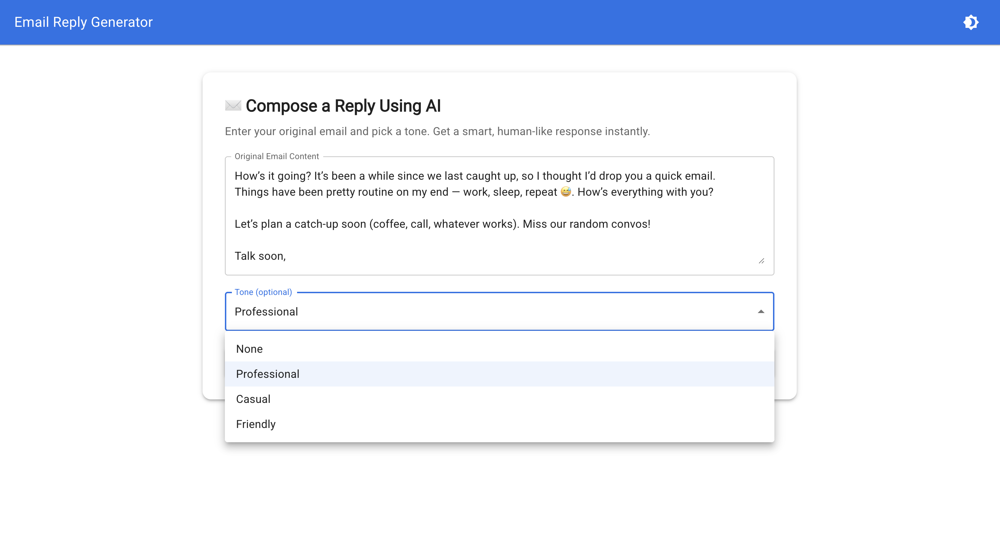
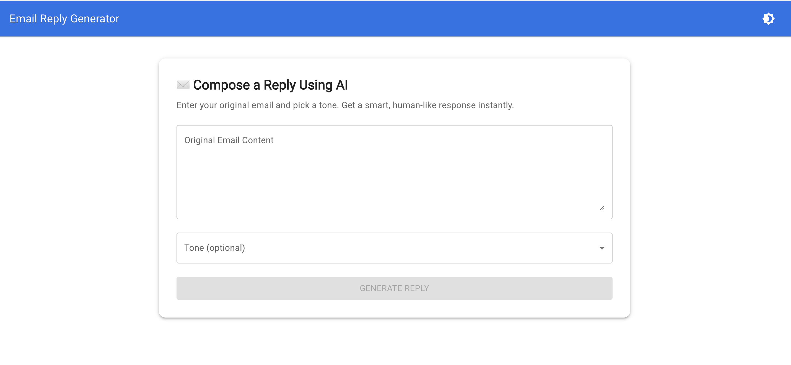
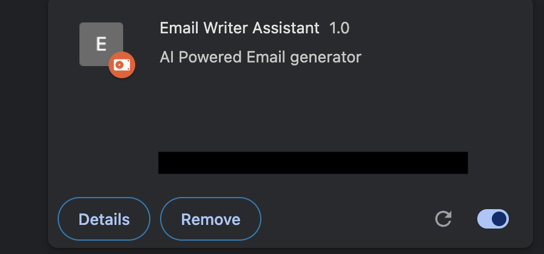

# ✉️ Email Writer Assistant - Chrome Extension

Boost your productivity and write better emails faster with **Email Writer Assistant** – a smart Chrome extension designed to help you compose professional, clear, and engaging emails with ease.

---

## 📸 Screenshots

> Preview the experience before installing.

### 🧩 Extension design




### 📝 Email Writing Extension



---

## 🚀 Features

- ✅ **Smart Email Suggestions**: Get AI-powered recommendations to improve your email.
- 🧠 **Context Aware**: Understands your tone and purpose for accurate suggestions.
- ✨ **One-click Insert**: Add polished content into your email drafts instantly.
- 🕵️‍♂️ **Privacy-first**: Your email data stays secure on your device.
- 🌐 **Works with Gmail & Webmail Clients**.

---

## 📦 Installation

You can install the extension manually or from the Chrome Web Store:

### 👉 From Chrome Web Store (Recommended)

> _(Add link once published)_

[Install from Chrome Web Store](#)

### 🛠️ Manual Installation (For Developers)

1. Clone or download this repository:
   ```bash
   git clone https://github.com/your-username/email-writer-assistant.git
